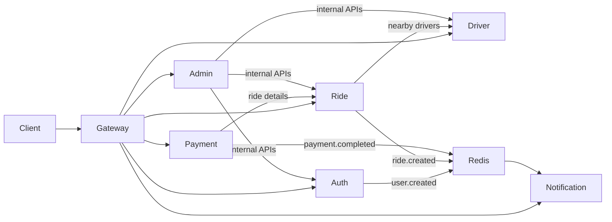

# MOVA Architecture

MOVA RDC is a **nationwide** ride-hailing platform for the Democratic Republic of Congo — designed for deployment across all 26 provinces, not only Kinshasa. Kinshasa remains the default launch city (communes, pricing seed, map center), but geo, matching, and communes models support expansion to Lubumbashi, Goma, Bukavu, Kisangani, and other RDC cities.

## Services

| Service | Port | Database | Responsibility |
|---------|------|----------|----------------|
| api-gateway | 3000 | — | Routing, JWT validation, throttling, aggregated health |
| auth-service | 3001 | postgres-auth | OTP auth, users, JWT issuance |
| ride-service | 3002 | postgres-rides | Rides, geo, pricing, ratings, WebSocket `/tracking` |
| payment-service | 3003 | postgres-payments | Wallets, mobile money, ride payments |
| driver-service | 3004 | postgres-drivers | Driver profiles, KYC, matching, incidents |
| notification-service | 3005 | postgres-notifications | Push/in-app notifications |
| admin-service | 3006 | — | Admin dashboard (proxies internal APIs) |

## Shared package

`packages/shared` (`@mova/shared`) provides:

- `MARKET_RDC` — nationwide RDC market config (+243, CDF), Kinshasa default city, phone validation, matching weights
- `MOVA_EVENTS` — Redis pub/sub event names
- `serviceUrl()` — inter-service HTTP URLs
- `RedisModule`, `HttpExceptionFilter`, error codes

## Communication

## Internal APIs

Services expose `/internal/*` routes protected by `x-internal-api-key` (`INTERNAL_API_KEY`).

## WebSocket tracking

Ride service exposes Socket.IO namespace `/tracking` for live driver location and ride status.

## Dev mocks

- `MOCK_OTP=true` — OTP code `123456`
- `MOCK_PAYMENTS=true` — simulated mobile money success
