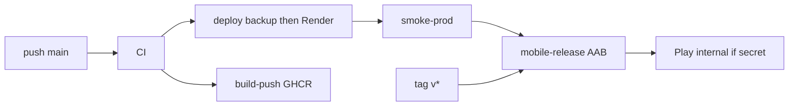

# CI/CD

## Pipeline (main)

Chaîne automatique après push sur `main` :

```
CI → Build and Push (GHCR) → Deploy (backup → Render) → Smoke prod → Mobile release (AAB → Play internal)
```

| Étape | Workflow | Déclencheur | Rôle |
|-------|----------|-------------|------|
| CI | `ci.yml` | PR / push `main`, `develop` | Build, tests unitaires, **régression Playwright**, Flutter, clients web/admin/restaurant/rental-partner, audit critique |
| Build & push | `build-push.yml` | CI réussi sur `main`, tags `v*` | Images Docker (API + web + portails) → GHCR + scan Trivy |
| Deploy | `deploy.yml` | **Build and Push** réussi sur `main` | **Backup pg_dump obligatoire**, déploiement Render (API + `mova-web` + admin/restaurant/rental) |
| Smoke prod | `smoke-prod.yml` | Deploy réussi sur `main` | Health gateway, geo, estimate, OTP |
| **Mobile release** | `mobile-release.yml` | Smoke prod OK sur `main`, tag `v*`, manuel | Build AAB ; **upload Play internal auto** si `PLAY_STORE_JSON_KEY` / `PLAY_STORE_JSON` est défini |

Un échec de CI **bloque** build-push (donc aussi Deploy).

## Jobs CI (`ci.yml`)

| Job | Contenu |
|-----|---------|
| `shared` | Build + tests `packages/shared` |
| `services` | Build + tests unitaires (×7) + e2e gateway |
| `clients` | Build + lint `web`, `admin`, `restaurant`, `rental-partner` |
| **`regression`** | Docker Compose + seed admin + Playwright admin/web |
| `mobile` | `flutter test` (35+ tests unit/widget) |
| `smoke-scripts` | Validation scripts shell + smoke léger |
| `security-audit` | `npm audit` — **échoue sur critical** ; high = warning |
| `codeql` | Analyse statique |

### Régression Playwright (gate CI)

1. `scripts/regression-ci.sh` — `docker compose up`, seed admin (`+243900000001` / OTP `123456`), démarre admin `:3002` et web `:3001`
2. Playwright — projets `admin` (login, users, restaurants) et `web` (accueil) + health gateway
3. `scripts/regression-ci-teardown.sh` — arrêt stack

Variables : `MOCK_OTP=true`, `E2E_REQUIRE_STACK=true` (pas de skip silencieux en CI).

**Appium mobile** : non exécuté en CI (émulateur Android lourd). Couverture mobile = `flutter test` dans le job `mobile`.

## Workflows manuels

| Workflow | Usage |
|----------|-------|
| `e2e.yml` | Régression complète manuelle (même specs Playwright) |
| `deploy.yml` | Déploiement manuel staging/production |
| `smoke-prod.yml` | Smoke prod avec URL gateway custom |
| `mobile-release.yml` | Build AAB/IPA ; Play upload auto si secret (smoke/`main`, tag, manuel) |

## Pipeline mobile (`mobile-release.yml`)

Chaîne après déploiement backend réussi :



| Déclencheur | Comportement |
|-------------|--------------|
| `workflow_run` smoke-prod OK sur `main` | Build AAB + **upload Play internal** si secret Play configuré (sinon skip gracieux) |
| Tag `v*` (ex. `v1.2.0`) | Build + upload Play Store internal + TestFlight (si secrets configurés) |
| `workflow_dispatch` | Build AAB + **upload Play internal** si secret (case `upload_ios_testflight` = iOS seulement) |

### Apps Android (flavors)

| Flavor | Package ID | Entrée | Play track |
|--------|------------|--------|------------|
| passager | `cd.mova.mova.passenger` | `lib/main_passenger.dart` | `internal` (puis promote alpha/prod dans Console) |
| chauffeur | `cd.mova.mova.driver` | `lib/main_driver.dart` | `internal` |

**Upload automatique :** après chaque build AAB réussi (smoke/`main`, tag `v*`, ou manuel), le job `upload-android` (env GitHub `production-mobile`) publie les deux AAB via Fastlane `deploy_internal` si un secret Play est présent. Sans secret → skip gracieux, AAB en artefacts Actions. Avec secret invalide ou erreur API Play → le job **échoue**.

### Fastlane

| Plateforme | Lane | Cible |
|------------|------|-------|
| Android | `deploy_internal` | Play Console — piste **internal** (×2 apps) |
| iOS | `beta` | TestFlight — app passager (`cd.mova.mova`) |

L'app chauffeur iOS nécessite un schéma Xcode / bundle ID dédié (non configuré) — voir section iOS ci-dessous.

### Build local (parité CI)

```powershell
.\scripts\build-mobile-release.ps1
```

```bash
source mobile/scripts/set-prod-env.sh
cd mobile
flutter build appbundle --release --flavor passenger -t lib/main_passenger.dart $MOVA_DART_DEFINES
```

### Signature Android

1. Copier `mobile/android/key.properties.example` → `mobile/android/key.properties`
2. Générer `upload-keystore.jks` (voir commentaires dans l'exemple)
3. En CI : encoder le `.jks` en base64 → secret `ANDROID_KEYSTORE_BASE64`

Sans keystore, le workflow produit des AAB signés debug (téléchargeables mais **non publiables** sur Play Store).

### iOS (macOS requis)

- Build IPA : runner `macos-latest` (coût ×10 vs Linux)
- Certificats : [fastlane match](https://docs.fastlane.tools/actions/match/) + dépôt privé certificats
- Alternative : [Codemagic](https://codemagic.io) ou Xcode Cloud si pas de runner macOS GitHub

Secrets App Store Connect requis pour TestFlight — voir tableau ci-dessous.

## Local CI

```powershell
.\scripts\verify-all.ps1
```

Régression locale (stack Docker requise) :

```powershell
# Terminal 1 — stack
docker compose up -d
npm run seed:admin-demo

# Terminal 2 — admin
cd admin; npm run dev

# Terminal 3 — tests
cd e2e
npm ci
npm run playwright:install
$env:E2E_REQUIRE_STACK = "true"
npm run test:e2e:admin
npm run test:e2e:web
```

Ou script tout-en-un (Linux / Git Bash / CI) :

```bash
./scripts/regression-ci.sh
cd e2e && npm ci && npx playwright install chromium
E2E_REQUIRE_STACK=true npm run test:e2e:admin
E2E_REQUIRE_STACK=true npm run test:e2e:web
./scripts/regression-ci-teardown.sh
```

## Backup avant migration

- **Production (CI Deploy)** : `deploy.yml` **exige** `DATABASE_URL_*` et exécute `scripts/backup-db.sh` avant le trigger Render (échec = pas de deploy). Escape hatch : `workflow_dispatch` + `skip_backup=true` (tests / urgence uniquement).
- **Conteneurs Docker / Render** : entrypoint `scripts/migrate-with-backup.sh` (backup puis `prisma migrate deploy` ; échec backup = pas de migrate). `MOVA_SKIP_BACKUP=1` ou `ALLOW_MIGRATE_WITHOUT_BACKUP=1` réservés aux tests.
- **Local** : `scripts/migrate-all.sh` / `migrate-all.ps1` (backup complet puis migrations)

## Docker images

Images construites depuis `docker/*.Dockerfile` avec contexte monorepo (`packages/shared` inclus).

```bash
docker compose build
docker compose up -d
```

## Secrets (GitHub)

| Secret | Usage |
|--------|-------|
| `RENDER_API_KEY` | API Render deploy hooks |
| `RENDER_SERVICE_IDS` | IDs services Render (espace-séparés) — sinon `config/render-services.json` |
| `GATEWAY_RENDER_SERVICE_ID` | Attente statut deploy gateway |
| `DATABASE_URL_AUTH` … `DATABASE_URL_NOTIFICATIONS` | **Obligatoires** pour backup pg_dump avant deploy prod |
| `SMOKE_API_URL` | URL gateway pour smoke prod (fallback) |
| **`PROD_API_URL`** | `--dart-define=API_URL` builds mobile — doit être `https://mova-gateway.onrender.com/api` (LAN/localhost rejetés par CI) |
| **`PROD_WS_URL`** | `--dart-define=WS_URL` builds mobile — doit être `https://mova-gateway.onrender.com` |
| **`ANDROID_KEYSTORE_BASE64`** | Keystore release encodé base64 |
| **`ANDROID_KEYSTORE_PASSWORD`** | Mot de passe keystore |
| **`ANDROID_KEY_PASSWORD`** | Mot de passe clé |
| **`ANDROID_KEY_ALIAS`** | Alias clé (ex. `mova-upload`) |
| **`PLAY_STORE_JSON_KEY`** | JSON compte de service Google Play (**base64**) — upload AAB auto après smoke |
| **`PLAY_SERVICE_ACCOUNT_JSON`** | Alias : même JSON Play en clair **ou** base64 (si `PLAY_STORE_JSON_KEY` absent) |
| **`PLAY_STORE_JSON`** | Alias : JSON Play en clair (si les deux précédents absents) |
| **`APP_STORE_CONNECT_KEY_ID`** | Clé API App Store Connect |
| **`APP_STORE_CONNECT_ISSUER_ID`** | Issuer ID App Store Connect |
| **`APP_STORE_CONNECT_API_KEY`** | Contenu `.p8` encodé base64 |
| **`MATCH_PASSWORD`** | Mot de passe chiffrement certificats match |
| **`MATCH_GIT_BASIC_AUTHORIZATION`** | Token lecture dépôt certificats (base64 `user:token`) |
| `APPLE_ID` | (optionnel) Compte développeur Apple |

### Environnement GitHub `production-mobile`

Protège les jobs d'upload Play Store / TestFlight. Pour l’upload auto post-smoke, soit retirer l’approbation requise sur cet environnement, soit l’approuver une fois par release.

## Variables

| Variable | Usage |
|----------|-------|
| `GATEWAY_URL` / `vars.GATEWAY_URL` | Smoke tests post-deploy |
