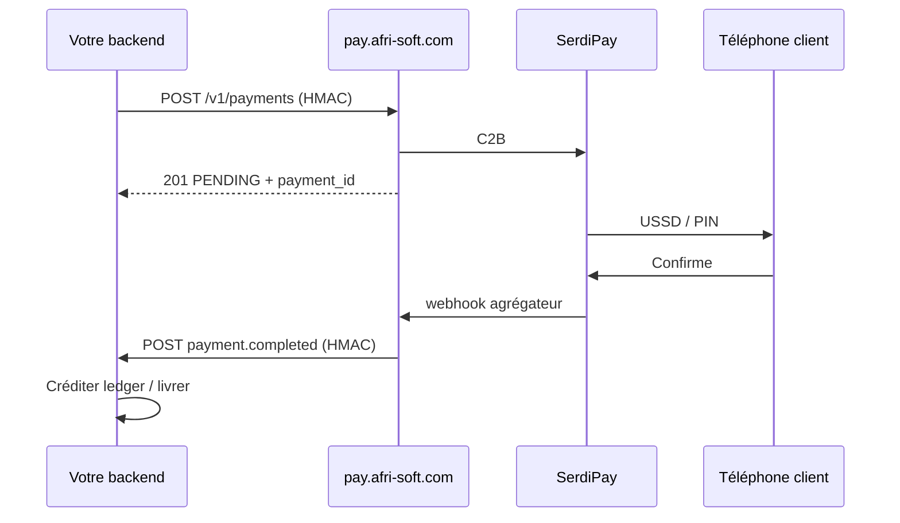

# Handoff Mobile Money — hub AfriSoft (`pay.afri-soft.com`)

**Public :** autre application AfriSoft qui **gère ses propres utilisateurs / son propre ledger**.  
**Langue :** français (termes techniques EN inchangés).  
**Version :** septembre 2026 — contrat réel de `services/payment-service` en mode hub (`AFRISOFT_PAY_HUB_MODE=true`) sur le VPS Hetzner.  
**Hub :** `https://pay.afri-soft.com` — déploiement `/opt/afrisoft-pay` (ne pas confondre avec `https://sms.afri-soft.com`).

Ce document est **autonome**. Vous n’avez pas besoin de `mova-auth`, ni du wallet SENGA, ni des clés SerdiPay / CinetPay.

Uniquement si vous voulez **le portefeuille SENGA** (JWT + `/api/wallet/*`) : ce n’est **pas** le chemin par défaut — restez sur ce hub `/v1`.

**Companion SMS/OTP (même auth `app_id` + HMAC) :** [afrisoft-sms-hub-otp.md](./afrisoft-sms-hub-otp.md)  
**Contrat long / ops VPS :** [AFRISOFT_PAYMENT_HUB_API.md](../AFRISOFT_PAYMENT_HUB_API.md)  
**Pack + snippets :** [afrisoft-pay-hub/](./afrisoft-pay-hub/) · env [afrisoft-pay-hub.env.example](./afrisoft-pay-hub.env.example)

---

## 1. Ce que vous appelez / What you call

| À utiliser | Ne pas utiliser |
|------------|-----------------|
| `https://pay.afri-soft.com` | `https://sms.afri-soft.com` (SMS) |
| `POST /v1/payments` (encaisser C2B) | `https://serdipay.com` depuis votre app |
| `POST /v1/payouts` (retirer B2C) | `https://api.afri-soft.com/api/wallet/*` (wallet SENGA) |
| `GET /v1/payments/{id}` / `…/by-reference/{ref}` | Clés `SERDIPAY_*`, `CINETPAY_*` |
| Headers HMAC `X-AfriSoft-*` depuis **votre backend** | Appels hub depuis le mobile / navigateur |

```
Votre app (vos users, votre ledger)
        │
        │  1. créer intention métier (facture, commande, top-up…)
        │  2. POST /v1/payments  (HMAC)  →  PENDING
        │  3. client confirme USSD / PIN opérateur
        │  4. webhook hub → votre URL  (HMAC)  →  COMPLETED | FAILED
        │  5. créditer VOTRE ledger / livrer le service
        ▼
https://pay.afri-soft.com   ←  VPS /opt/afrisoft-pay  (IP 178.104.82.66)
        │
        ▼
SerdiPay (C2B / B2C)  —  secrets uniquement sur le hub
(+ CinetPay collect optionnel côté hub, sticky MOBILE_MONEY_GATEWAY)
```

Appelez le hub **uniquement depuis votre serveur**. Jamais depuis le mobile / le navigateur (la clé HMAC fuirait).

### Pourquoi un hub (et pas un compte SerdiPay par app) ?

| Sans hub | Avec hub |
|----------|----------|
| N comptes SerdiPay / CinetPay | **1** contrat derrière le hub |
| N IPs à faire whitelist | **1** VPS (`pay.afri-soft.com`) |
| Credentials dispersés | Secrets **uniquement** dans le hub |
| Onboarding long | Nouvelle app = `app_id` + clé HMAC + `webhook_url` |

**Les apps ne doivent PAS être sur le même VPS.** Seul le hub sort depuis l’IP whitelist SerdiPay. Votre app peut tourner sur Render, Vercel, autre VPS, etc.

**Le wallet SENGA n’est pas partagé.** SENGA crédite *son* ledger ; vous créditez *le vôtre*.

---

## 2. Authentification / Auth (HMAC)

Quatre headers **obligatoires** (noms exacts) :

| Header | Valeur |
|--------|--------|
| `X-AfriSoft-App-Id` | `app_id` minuscules (`educongo`, `votreapp`, …) |
| `X-AfriSoft-Api-Key` | secret HMAC (même valeur que pour signer) |
| `X-AfriSoft-Timestamp` | Unix **secondes** |
| `X-AfriSoft-Signature` | hex HMAC-SHA256 |
| `Content-Type` | `application/json` |

```
string_to_sign = "{timestamp}.{METHOD}.{path}.{raw_body}"
signature      = hex( HMAC-SHA256(api_key, string_to_sign) )
```

- `path` : chemin exact **sans** host ni query, ex. `/v1/payments`, `/v1/payouts`
- `raw_body` : le JSON **exact** envoyé. Signez `JSON.stringify(obj)` puis envoyez **cette** chaîne. GET : chaîne vide `""`
- Skew max : **300 s** → sinon 401
- `app_id` du body = header, sinon 403

À l’onboarding AfriSoft vous recevez aussi :

| Élément | Rôle |
|---------|------|
| `webhook_secret` | Vérifier les webhooks **hub → votre app** (sinon le hub signe avec `api_key`) |
| `webhook_url` | URL HTTPS que **vous** exposez ; AfriSoft l’enregistre côté hub |

---

## 3. Flux recommandé — C2B (encaisser)

Le hub **encaisse** sur le compte marchand AfriSoft. **Vous** tenez le ledger métier et livrez le service.

### 5 étapes

1. **Créer** une intention dans **votre** DB (facture, commande, top-up…) avec montant attendu.
2. **Appeler** `POST https://pay.afri-soft.com/v1/payments` (HMAC) → réponse `PENDING` + `payment_id`.
3. **Afficher** « Confirmez sur votre téléphone Mobile Money » (USSD / PIN). Si `paymentUrl` est présent (CinetPay), l’ouvrir.
4. **Recevoir** le webhook `payment.completed` / `payment.failed` (HMAC) **ou** poller `GET /v1/payments/...`.
5. **Créditer** votre ledger / marquer payé **uniquement** si `COMPLETED` + `amount_cdf` = montant attendu (fail-closed). Idempotence sur `payment_id` / `reference`.



---

## 4. Encaisser — `POST /v1/payments`

**Request**

```http
POST /v1/payments HTTP/1.1
Host: pay.afri-soft.com
Content-Type: application/json
X-AfriSoft-App-Id: educongo
X-AfriSoft-Api-Key: CHANGE_ME
X-AfriSoft-Timestamp: 1735689600
X-AfriSoft-Signature: <hmac_hex>
```

```json
{
  "app_id": "educongo",
  "amount_cdf": 2500,
  "currency": "CDF",
  "phone": "243970000001",
  "telecom": "MP",
  "reference": "educongo_pay_550e8400-e29b-41d4-a716-446655440000",
  "purpose": "pay",
  "metadata": { "invoice_id": "INV-2026-001" },
  "idempotency_key": "educongo:INV-2026-001:pay"
}
```

| Champ | Obligatoire | Notes |
|-------|-------------|--------|
| `app_id` | oui | Identique au header |
| `amount_cdf` | oui | Entier. Validation hub ≥ **500** ; plancher SerdiPay prod souvent **≥ 2 300 FC** |
| `currency` | oui | `CDF` uniquement |
| `phone` | oui | RDC, §7 |
| `telecom` | oui | `OM` \| `MP` \| `AM` \| `AF` — §8 |
| `reference` | oui | `{app_id}_{purpose}_{uuid}` — unique par app |
| `purpose` | non | Défaut `pay` (`tuition`, `topup`, `delivery`…) |
| `metadata` | non | Renvoyé tel quel dans le webhook |
| `idempotency_key` | recommandé | Body, **pas** un header. Fenêtre de rejeu → même `payment_id` |

**Response 201**

```json
{
  "payment_id": "pay_a1b2c3d4e5f6789012345678",
  "status": "PENDING",
  "reference": "educongo_pay_550e8400-e29b-41d4-a716-446655440000",
  "provider_ref": "sp_987654",
  "amount_cdf": 2500,
  "telecom": "MP",
  "completed_at": null,
  "message": "Confirmez le paiement sur votre téléphone Mobile Money."
}
```

Statuts : `PENDING` → `COMPLETED` \| `FAILED` (webhook + GET).  
Le contrôleur répond **toujours HTTP 201** (y compris rejeu idempotent). Distinguez le rejeu par `payment_id` / `reference` identiques.

CinetPay peut ajouter `paymentUrl`. SerdiPay : généralement push USSD, pas d’URL.

---

## 5. Retirer / payer un bénéficiaire — `POST /v1/payouts`

Même body que §4. Défaut `purpose` = `withdraw`.

```http
POST /v1/payouts HTTP/1.1
Host: pay.afri-soft.com
```

- **SerdiPay B2C** vers `phone` / `telecom` (`OM` / `MP` / `AM` / `AF`).
- **CinetPay** : **non supporté** sur ce hub → HTTP 400.
- Le hub **débite le compte marchand AfriSoft**, pas votre ledger utilisateur. Débitez **votre** solde métier **avant** le payout ; si l’init échoue, recréditez.

**Important :** C2B et B2C sont des **produits séparés** chez SerdiPay. Un C2B M-Pesa réussi ne signifie **pas** que le B2C est ouvert. Si l’agrégateur répond « Merchant is not allowed to use this channel », faire activer le payout / AfriMomo côté SerdiPay — **ne pas** simuler un versement.

Réponse : même forme que §4 (`payment_id`, `status` `PENDING`). Les payouts se consultent sur `GET /v1/payments/{id}` (pas de `GET /v1/payouts/...`).

### Flux retrait recommandé

1. Vérifier solde métier + min ≥ **2 300 FC** (prod).
2. Débiter votre ledger (idempotent).
3. `POST /v1/payouts`.
4. Si init échoue → recréditer.
5. Webhook `COMPLETED` / `FAILED` → finaliser ; en `FAILED` après débit, recréditer.

---

## 6. Statut — `GET /v1/payments/{payment_id}`

Ou : `GET /v1/payments/by-reference/{reference}`

HMAC GET : `raw_body` = `""`. Isolation : un `app_id` ne voit que ses lignes. Introuvable → **404**.

```json
{
  "payment_id": "pay_a1b2c3d4e5f6789012345678",
  "status": "COMPLETED",
  "reference": "educongo_pay_550e8400-e29b-41d4-a716-446655440000",
  "provider_ref": "sp_987654",
  "amount_cdf": 2500,
  "telecom": "MP",
  "completed_at": "2026-09-10T10:00:00.000Z"
}
```

### Webhooks agrégateur (internes) — ne pas appeler

```http
POST https://pay.afri-soft.com/webhooks/serdipay
GET|POST https://pay.afri-soft.com/webhooks/cinetpay
```

Enregistrés **une fois** chez l’agrégateur. Vos apps **n’utilisent pas** ces chemins.

---

## 7. Webhook sortant hub → votre app

Quand le statut devient final, le hub POST vers `AFRISOFT_HUB_WEBHOOK_URL_<APPID>` (3 tentatives). Répondez **2xx en < 5 s**.

```http
POST https://educongo.example.com/webhooks/afrisoft-payments
X-AfriSoft-App-Id: educongo
X-AfriSoft-Event: payment.completed
X-AfriSoft-Timestamp: 1735689700
X-AfriSoft-Signature: <hmac_hex>
Content-Type: application/json
```

**Signature (hub → app) :** même formule, secret = `webhook_secret` (ou `api_key` si secret vide).  
`path` signé = pathname de **votre** URL (le hub peut retirer un préfixe `/api/v1` → `/v1`).

**Succès**

```json
{
  "event": "payment.completed",
  "payment_id": "pay_a1b2c3d4e5f6789012345678",
  "app_id": "educongo",
  "status": "COMPLETED",
  "reference": "educongo_pay_550e8400-e29b-41d4-a716-446655440000",
  "provider_ref": "sp_987654",
  "amount_cdf": 2500,
  "currency": "CDF",
  "phone": "243970000001",
  "telecom": "MP",
  "purpose": "pay",
  "metadata": { "invoice_id": "INV-2026-001" },
  "occurred_at": "2026-09-10T10:00:00.000Z"
}
```

**Échec :** `event` = `payment.failed`, `status` = `FAILED`, `failure_reason` optionnel.  
Payouts = **mêmes** événements — distinguez par `purpose` / `reference`.

**Règles obligatoires côté app :**

1. Vérifier HMAC (timing-safe).
2. Idempotence : un même `payment_id` peut être rejoué.
3. Fail-closed montant : si `amount_cdf` ≠ intention → **ne pas** créditer.
4. En cas de 5xx / timeout : le hub retente 3× ; poller le GET en secours.
5. Ne créditez un ledger **que** sur `COMPLETED`.

Snippet : [afrisoft-pay-hub/verify-webhook.example.mjs](./afrisoft-pay-hub/verify-webhook.example.mjs).

---

## 8. Téléphone RDC + opérateurs

### Téléphone

Normalisé en `243XXXXXXXXX` (sans `+`) :

| Entrée | Résultat |
|--------|----------|
| `+243970000001` | `243970000001` |
| `243970000001` | inchangé |
| `0970000001` | `243970000001` |

Sinon HTTP **400**.

### Opérateurs (`telecom`)

| Code | Opérateur | Notes prod (sept. 2026) |
|------|-----------|-------------------------|
| `MP` | M-Pesa (Vodacom) | **Recommandé** pour tests C2B / B2C |
| `AM` | Airtel Money | **Recommandé** |
| `OM` | Orange Money | Souvent **flaky** côté SerdiPay (accept sans USSD / sans webhook) — préférer MP/AM tant que non stabilisé |
| `AF` | AfriMoney | Selon activation marchand |

L’API HTTP n’accepte que ces **4 codes**. Alias type `MPESA` / `ORANGE_MONEY` existent seulement dans le client TypeScript SENGA.

### Référence

```
{app_id}_{purpose}_{uuid}
```

Ex. `educongo_tuition_550e8400-e29b-41d4-a716-446655440000`  
Unique par `(app_id, reference)` : un doublon **ne relance pas** l’agrégateur.

### Idempotence

Champ body `idempotency_key`. Suggestion : `{app_id}:{purpose}:{invoice_id}` ou `{app_id}:{purpose}:{phone}:{fenêtre}`.

### Montants

| Règle | Valeur |
|-------|--------|
| Min DTO hub | ≥ **500** FC |
| Plancher SerdiPay prod (C2B / B2C) | souvent ≥ **2 300** FC |
| Devise | `CDF` uniquement |

---

## 9. Erreurs, health

Health public (sans HMAC) : `GET https://pay.afri-soft.com/health`

Enveloppe Nest typique :

```json
{
  "success": false,
  "error": { "code": "MOVA_VAL_001", "message": "…" },
  "timestamp": "2026-09-10T10:00:00.000Z"
}
```

Testez surtout le **status HTTP** + `error.message`.

| HTTP | Quand |
|------|--------|
| 401 | Headers / clé / HMAC / horloge (skew > 300 s) |
| 403 | `app_id` inconnu ou mismatch header/body |
| 400 | Body invalide (montant, phone, telecom) ou agrégateur refuse l’init |
| 400 | Payout CinetPay non supporté |
| 404 | Paiement inconnu / autre `app_id` |
| 503 | Agrégateur non configuré sur le VPS |

---

## 10. Variables d’environnement / Env

Fichier placeholders : [afrisoft-pay-hub.env.example](./afrisoft-pay-hub.env.example). Copiez-le en `.env` **local / privé** (hors git).

| Variable **côté votre app** | D’où ça vient |
|-----------------------------|---------------|
| `AFRISOFT_PAY_HUB_URL` | Toujours `https://pay.afri-soft.com` |
| `AFRISOFT_HUB_APP_ID` | Partie **gauche** d’une paire dans `AFRISOFT_HUB_APPS` sur le VPS |
| `AFRISOFT_HUB_API_KEY` | Partie **droite** (`app_id:api_key`) — header + HMAC |
| `AFRISOFT_HUB_WEBHOOK_SECRET` | `AFRISOFT_HUB_WEBHOOK_SECRET_<APPID>` ou, à défaut, la même `api_key` |

**Source ops (noms seuls) :** `/opt/afrisoft-pay/.env` sur le VPS Hetzner (`178.104.82.66`).

- Extraire **uniquement** la paire utile de `AFRISOFT_HUB_APPS`.
- Donner à AfriSoft votre `webhook_url` HTTPS pour `AFRISOFT_HUB_WEBHOOK_URL_<APPID>`.
- Transmettre les secrets **par canal privé** (pas GitHub, pas ce dépôt, pas `pay.json`).
- **Ne jamais** copier `SERDIPAY_*`, `CINETPAY_*`, `MOCK_PAYMENTS`, `DATABASE_URL` du hub.

Alias acceptés (client SENGA) : `PAY_HUB_URL`, `AFRISOFT_PAY_BASE_URL`, `AFRISOFT_PAY_HUB_APP_ID`, `AFRISOFT_PAY_HUB_API_KEY`, `AFRISOFT_PAY_HUB_WEBHOOK_SECRET`.

---

## 11. cURL + Node (aucun secret)

```bash
export AFRISOFT_PAY_HUB_URL=https://pay.afri-soft.com
export AFRISOFT_HUB_APP_ID=educongo
# export AFRISOFT_HUB_API_KEY=CHANGE_ME   # canal privé, pas git
TS=$(date +%s)
BODY='{"app_id":"educongo","amount_cdf":2500,"currency":"CDF","phone":"243970000001","telecom":"MP","reference":"educongo_pay_550e8400-e29b-41d4-a716-446655440000","purpose":"pay","idempotency_key":"educongo:pay:demo1"}'
SIG=$(node -e "const c=require('crypto');process.stdout.write(c.createHmac('sha256',process.env.AFRISOFT_HUB_API_KEY).update(process.argv[1]+'.POST./v1/payments.'+process.argv[2]).digest('hex'))" "$TS" "$BODY")
curl -sS -X POST "$AFRISOFT_PAY_HUB_URL/v1/payments" \
  -H "Content-Type: application/json" \
  -H "X-AfriSoft-App-Id: $AFRISOFT_HUB_APP_ID" \
  -H "X-AfriSoft-Api-Key: $AFRISOFT_HUB_API_KEY" \
  -H "X-AfriSoft-Timestamp: $TS" \
  -H "X-AfriSoft-Signature: $SIG" \
  -d "$BODY"
```

```js
import crypto from 'node:crypto';

const base = process.env.AFRISOFT_PAY_HUB_URL; // https://pay.afri-soft.com
const appId = process.env.AFRISOFT_HUB_APP_ID;
const apiKey = process.env.AFRISOFT_HUB_API_KEY;
const path = '/v1/payments';
const body = JSON.stringify({
  app_id: appId,
  amount_cdf: 2500,
  currency: 'CDF',
  phone: '243970000001',
  telecom: 'MP',
  reference: `${appId}_pay_${crypto.randomUUID()}`,
  purpose: 'pay',
  idempotency_key: `${appId}:pay:demo1`,
});
const ts = String(Math.floor(Date.now() / 1000));
const sig = crypto.createHmac('sha256', apiKey).update(`${ts}.POST.${path}.${body}`).digest('hex');

const res = await fetch(`${base}${path}`, {
  method: 'POST',
  headers: {
    'Content-Type': 'application/json',
    'X-AfriSoft-App-Id': appId,
    'X-AfriSoft-Api-Key': apiKey,
    'X-AfriSoft-Timestamp': ts,
    'X-AfriSoft-Signature': sig,
  },
  body,
});
console.log(res.status, await res.json());
```

Snippets copiables :

- [afrisoft-pay-hub/create-payment.example.mjs](./afrisoft-pay-hub/create-payment.example.mjs)
- [afrisoft-pay-hub/create-payout.example.mjs](./afrisoft-pay-hub/create-payout.example.mjs)
- [afrisoft-pay-hub/verify-webhook.example.mjs](./afrisoft-pay-hub/verify-webhook.example.mjs)

---

## 12. Ce que le hub ne fait PAS (à implémenter chez vous)

| Primitive hub | À votre charge |
|---------------|----------------|
| C2B / B2C + webhooks | Ledger utilisateurs, soldes, commissions |
| | Escrow / séquestre / remboursement métier |
| | Preuve de livraison, litiges, KYC métier |
| | UI choix opérateur, OTP retrait (si vous en voulez un) |

Le hub est un **rail** Mobile Money. La garantie métier (encaisser avant prestation, payout après preuve) est **dans votre app** — comme SENGA pour courses / livraisons.

---

## 13. Checklist

1. AfriSoft enregistre votre `app_id` dans `AFRISOFT_HUB_APPS` + votre `webhook_url` (+ secret optionnel).
2. Vous recevez `AFRISOFT_HUB_APP_ID` + `AFRISOFT_HUB_API_KEY` + `AFRISOFT_HUB_WEBHOOK_SECRET` **en privé**.
3. HMAC uniquement côté backend ; jamais de `SERDIPAY_*` dans votre repo.
4. `GET /health` puis un vrai `+243` via `POST /v1/payments` (≥ **2 300 FC**, préférer **MP** ou **AM**).
5. Implémenter webhook HMAC + idempotence + fail-closed montant.
6. Tester `POST /v1/payouts` seulement si B2C est ouvert chez SerdiPay.
7. Gérer 401 / 403 / 400 / 404 / 503. Ne pas ouvrir un compte SerdiPay séparé.
8. (Optionnel) Même `app_id` / paire de clés que le hub SMS si AfriSoft vous le fournit ainsi.

Contrat long / ops VPS : [AFRISOFT_PAYMENT_HUB_API.md](../AFRISOFT_PAYMENT_HUB_API.md).  
Pack détaillé (y compris notes SENGA livraisons) : [afrisoft-pay-hub.md](./afrisoft-pay-hub.md).

---

## 14. Sécurité

- Jamais de secrets agrégateur dans l’app cliente ni dans git.
- TLS obligatoire ; pas de webhook HTTP clair.
- Logs : masquer `phone` partiel ; ne jamais logger `api_key` / PIN / secrets.
- Rotation `api_key` / `webhook_secret` sans redeploy agrégateur (ops VPS).
- Fail-closed montant : ne jamais créditer si `amount_cdf` webhook ≠ intention.
