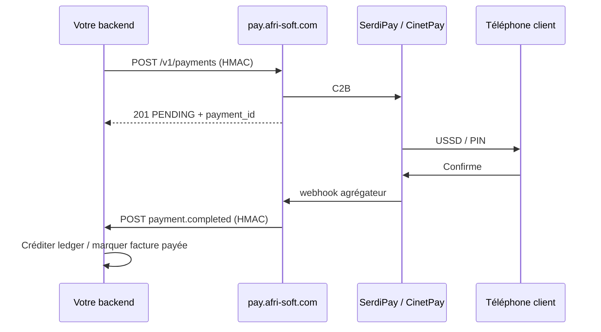
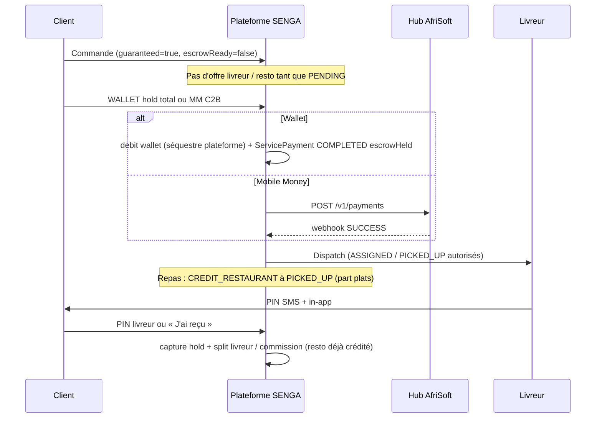

# Pack d’intégration — Payment Hub AfriSoft (app sœur)

**Handoff canonique :** ce document · env [afrisoft-pay-hub.env.example](./afrisoft-pay-hub.env.example)  
**Contrat long / ops VPS :** [AFRISOFT_PAYMENT_HUB_API.md](../AFRISOFT_PAYMENT_HUB_API.md)  
**Companion SMS :** [afrisoft-sms-otp/README.md](./afrisoft-sms-otp/README.md) · [afrisoft-sms-hub.env.example](./afrisoft-sms-hub.env.example)

**Public :** équipe d’une **autre application AfriSoft** (ou future app) qui veut encaisser / reverser du Mobile Money RDC **sans** ouvrir un compte SerdiPay / CinetPay, **sans** IP whitelist, **sans** réutiliser le wallet SENGA.  
**Langue :** français  
**Version :** septembre 2026 — contrat réel de `services/payment-service` en mode hub (`AFRISOFT_PAY_HUB_MODE=true`)  
**URL de base :** `https://pay.afri-soft.com`  
**Ne pas utiliser :** `sms.afri-soft.com` (SMS) · `api.afri-soft.com` (identité / wallet SENGA) · `serdipay.com` depuis votre app

---

## 0. Ce que vous recevez / ce que vous ne recevez pas

| Vous recevez (à coller dans *votre* `.env`) | Vous ne recevez **jamais** |
|---------------------------------------------|----------------------------|
| `AFRISOFT_PAY_HUB_URL` | `SERDIPAY_*` / `CINETPAY_*` |
| `AFRISOFT_HUB_APP_ID` | `AFRICAS_TALKING_*` |
| `AFRISOFT_HUB_API_KEY` | `MOCK_PAYMENTS`, PIN marchand, `DATABASE_URL` du hub |
| `AFRISOFT_HUB_WEBHOOK_SECRET` | JWT SENGA, ledger wallet SENGA |
| Une URL de webhook enregistrée côté hub | Accès SSH au VPS |

Les secrets agrégateurs restent **uniquement** sur le VPS `/opt/afrisoft-pay/.env`. Votre backend parle au hub ; le hub parle à SerdiPay / CinetPay.

**Ne jamais committer** le `.env` rempli (GitHub, Slack public, tickets, captures d’écran).

---

## 1. Réponses clés

### Pourquoi un hub paiements (et pas un compte SerdiPay par app) ?

Même logique que le hub SMS. **Un** contrat marchand, **une** IP whitelist SerdiPay (`178.104.82.66`), **un** callback agrégateur, une surface d’intégration unique.

| Sans hub | Avec hub |
|----------|----------|
| N comptes SerdiPay / CinetPay | **1** contrat derrière le hub |
| N IPs à faire whitelist | **1** VPS (`pay.afri-soft.com`) |
| Credentials dispersés | Secrets **uniquement** dans le hub |
| Onboarding long | Nouvelle app = `app_id` + clé HMAC + `webhook_url` |

### Les apps doivent-elles être sur le même VPS ?

**Non.** Seul le processus `AFRISOFT_PAY_HUB_MODE=true` doit sortir depuis l’IP VPS. Votre app peut tourner n’importe où (Render, Vercel, autre VPS…), à condition d’appeler le hub en HTTPS et d’exposer un webhook HTTPS.

### Le hub garantit-il que le client d’une livraison paiera le livreur ?

**Non — pas au niveau du hub.** Le hub est un **rail** C2B (encaissement) + B2C (retrait). La garantie métier (séquestre, encaissement avant départ, payout après preuve) est **à implémenter dans votre app**. Voir **§10** pour l’état réel SENGA et le pattern recommandé.

### Le wallet SENGA est-il partagé ?

**Non.** SENGA crédite *son* ledger à réception du webhook. Votre app crédite *le vôtre*. Ne pas appeler `/api/wallet/*` SENGA.

---

## 2. Architecture

```
Votre app ──┐
SENGA       ┼── HTTPS (app_id + HMAC) ──►  Hub AfriSoft
Future      ┘                              pay.afri-soft.com
                                           • auth app
                                           • crée / suit les paiements
                                           • 1 seul dialogue agrégateur
                                                    │
                                    MOBILE_MONEY_GATEWAY = serdipay | cinetpay
                                                    │
                              ┌─────────────────────┴─────────────────────┐
                              ▼                                           ▼
                         SerdiPay C2B/B2C                           CinetPay collect
                         (IP whitelist VPS)                         (pas d’IP fixe)
                              │                                           │
                              └──────── webhook agrégateur ───────────────┘
                                              │
                                              ▼
                                    Hub finalise PENDING → COMPLETED|FAILED
                                              │
                              webhook HMAC ───┴──►  votre /webhooks/afrisoft-payments
```

### Règles d’or

1. **Seul le hub** détient `SERDIPAY_*` / `CINETPAY_*` et appelle l’agrégateur.
2. Chaque app a un **`app_id`** stable (`senga`, `educongo`, …) — **mêmes identifiants** que le hub SMS quand c’est possible.
3. Chaque opération a une **référence unique** : `{app_id}_{purpose}_{uuid}` (§6).
4. L’agrégateur envoie **un** webhook au hub ; le hub notifie **votre** `webhook_url`.
5. Switch sticky : `MOBILE_MONEY_GATEWAY=serdipay|cinetpay` — **pas** de failover silencieux (côté hub, pas chez vous).
6. Les téléphones finaux **n’appellent pas** le hub : seuls les backends (server-to-server).

---

## 3. Authentification (app → hub)

Quatre headers **obligatoires** (noms exacts de `hub-hmac.guard.ts`) :

| Header | Exemple |
|--------|---------|
| `X-AfriSoft-App-Id` | `educongo` (minuscules) |
| `X-AfriSoft-Api-Key` | même secret que HMAC |
| `X-AfriSoft-Timestamp` | Unix **secondes** (ex. `1735689600`) |
| `X-AfriSoft-Signature` | hex HMAC-SHA256 |
| `Content-Type` | `application/json` |

Formule (identique au hub SMS) :

```
string_to_sign = "{timestamp}.{METHOD}.{path}.{raw_body}"
signature      = hex( HMAC-SHA256(api_key, string_to_sign) )
```

- `path` : chemin exact **sans** host ni query, ex. `/v1/payments`
- `raw_body` : le JSON **exact** envoyé (même espaces, même ordre de clés). Signez `JSON.stringify(obj)` puis envoyez **cette** chaîne. GET : chaîne vide.
- Skew max : **300 secondes**. Au-delà → 401 (signature / timestamp rejetés).
- `app_id` du body doit égaler le header (sinon 403).

Exemple (Node) :

```js
import crypto from 'node:crypto';
const ts = String(Math.floor(Date.now() / 1000));
const path = '/v1/payments';
const body = JSON.stringify(payload);
const sig = crypto.createHmac('sha256', apiKey).update(`${ts}.POST.${path}.${body}`).digest('hex');
```

Appelez le hub **uniquement depuis votre serveur**. Jamais depuis le mobile / le navigateur (la clé HMAC fuirait).

---

## 4. Endpoints

Base : `https://pay.afri-soft.com`  
Préfixe : `/v1` (exposé **sans** préfixe `/api` — voir `main.ts`).

Health public (sans HMAC) : `GET https://pay.afri-soft.com/health`

```json
{
  "status": "ok",
  "service": "payment-service",
  "payHub": { "url": "https://pay.afri-soft.com", "mode": "hub", "reachable": true }
}
```

### 4.1 Encaisser (C2B) — `POST /v1/payments`

Le client confirme sur son téléphone (USSD / PIN opérateur). Réponse **asynchrone** : `PENDING`.

**Requête**

```http
POST /v1/payments HTTP/1.1
Host: pay.afri-soft.com
Content-Type: application/json
X-AfriSoft-App-Id: educongo
X-AfriSoft-Api-Key: YOUR_PAY_HUB_API_KEY
X-AfriSoft-Timestamp: 1735689600
X-AfriSoft-Signature: <hmac_hex>
```

```json
{
  "app_id": "educongo",
  "amount_cdf": 15000,
  "currency": "CDF",
  "phone": "243970000001",
  "telecom": "OM",
  "reference": "educongo_tuition_550e8400-e29b-41d4-a716-446655440000",
  "purpose": "tuition",
  "metadata": { "invoice_id": "INV-2026-001" },
  "idempotency_key": "educongo:INV-2026-001:pay"
}
```

| Champ | Obligatoire | Notes |
|-------|-------------|--------|
| `app_id` | oui | Identique au header |
| `amount_cdf` | oui | Entier **≥ 500** (validation hub). Plancher SerdiPay prod souvent **≥ 2 300 FC** — un montant 500–2299 peut être accepté par le DTO puis refusé par l’agrégateur. |
| `currency` | oui | `CDF` uniquement |
| `phone` | oui | `243…` ou `+243…` — voir §6 |
| `telecom` | oui | `OM` \| `MP` \| `AM` \| `AF` |
| `reference` | oui | Unique par `app_id`, min. 8 caractères. Format recommandé §6. |
| `purpose` | non | Défaut `pay`. Segment libre (`tuition`, `topup`, `delivery`…). |
| `metadata` | non | JSON objet. Renvoyé tel quel dans le webhook (+ `paymentUrl` éventuel). |
| `idempotency_key` | recommandé | Body, **pas** un header. Rejeu → même `payment_id`. |

**Réponse 201**

```json
{
  "payment_id": "pay_a1b2c3d4e5f6789012345678",
  "status": "PENDING",
  "reference": "educongo_tuition_550e8400-e29b-41d4-a716-446655440000",
  "provider_ref": "sp_987654",
  "amount_cdf": 15000,
  "telecom": "OM",
  "completed_at": null,
  "message": "Confirmez le paiement sur votre téléphone Mobile Money."
}
```

CinetPay peut ajouter `paymentUrl` (guichet web à ouvrir côté client final). SerdiPay : généralement push USSD, pas d’URL.

Statuts : `PENDING` → `COMPLETED` \| `FAILED` (webhook + GET).

Le contrôleur répond **toujours HTTP 201** (y compris rejeu idempotent). Distinguez le rejeu par `payment_id` / `reference` identiques, pas par le code HTTP.

### 4.2 Retirer / payer un bénéficiaire (B2C) — `POST /v1/payouts`

Même body que §4.1. Défaut `purpose` = `withdraw`.

```http
POST /v1/payouts HTTP/1.1
```

- **SerdiPay** : B2C (`payment-client`) vers le `phone` / `telecom` (`OM` / `MP` / `AM` / `AF`). Le corps Public API n’envoie **pas** de champ `channel` — `channel0` dans une erreur AfriMomo est l’id interne du rail (souvent B2C non ouvert), pas un bug de mapping SENGA.
- **CinetPay** : **non supporté** → HTTP 400, message « Retraits CinetPay non supportés sur le hub. » SerdiPay est le seul rail payout.

**Activation marchand (ops) :** C2B (`payment-merchant`) et B2C (`payment-client`) sont des **produits séparés** chez SerdiPay / AfriMomo. Un C2B M-Pesa réussi (ex. recharge 2 300 FC) ne signifie **pas** que le décaissement est ouvert. Si SerdiPay répond `Merchant is not allowed to use this channel` (souvent concaténé `channel0`), le marchand n’a pas le rail B2C. SENGA refuse le retrait, **recrédite le wallet** (idempotent, pas de double payout) et affiche un message français — **ne pas** simuler un versement. Faire activer B2C / payout (AfriMomo) sur le dashboard SerdiPay, puis réessayer.

Le hub **débite le compte marchand AfriSoft**, pas le wallet de votre utilisateur. Si vous devez d’abord prélever un client, encaisser en C2B (§4.1) **puis** payout — ou tenir un ledger interne et ne payout que si le solde métier le permet (c’est ce que fait SENGA pour les retraits chauffeur).

Réponse : même forme que §4.1 (`payment_id` préfixe `pay_…`, `status` `PENDING`).

### 4.3 Statut — `GET /v1/payments/{payment_id}`

Ou : `GET /v1/payments/by-reference/{reference}`

HMAC GET : `raw_body` = `""` (chaîne vide).  
Les payouts se consultent **sur les mêmes URLs** (pas de `GET /v1/payouts/...`). Isolation : un `app_id` ne voit que ses lignes.

```json
{
  "payment_id": "pay_a1b2c3d4e5f6789012345678",
  "status": "COMPLETED",
  "reference": "educongo_tuition_550e8400-e29b-41d4-a716-446655440000",
  "provider_ref": "sp_987654",
  "amount_cdf": 15000,
  "telecom": "OM",
  "completed_at": "2026-09-05T10:00:00.000Z"
}
```

Introuvable → HTTP **404**.

### 4.4 Webhooks agrégateur (internes hub) — ne pas appeler

```http
POST https://pay.afri-soft.com/webhooks/serdipay
GET|POST https://pay.afri-soft.com/webhooks/cinetpay
```

Enregistrés **une fois** chez l’agrégateur. Vos apps **n’utilisent pas** ces chemins.

---

## 5. Webhook sortant hub → votre app

Quand le statut devient final, le hub POST vers `AFRISOFT_HUB_WEBHOOK_URL_<APPID>` (3 tentatives, délai 400 ms × n°). Répondez **2xx en < 5 s**.

```http
POST https://educongo.example.com/webhooks/afrisoft-payments
X-AfriSoft-App-Id: educongo
X-AfriSoft-Event: payment.completed
X-AfriSoft-Timestamp: 1735689700
X-AfriSoft-Signature: <hmac_hex>
Content-Type: application/json
```

**Signature (hub → app) :** même formule, secret = `webhook_secret` de l’app, ou **`api_key` si le secret dédié est vide**.

`path` signé = pathname de votre URL (le hub retire un préfixe `/api/v1` → `/v1` s’il est présent). Vérifiez avec le pathname réel de la requête reçue.

**Succès**

```json
{
  "event": "payment.completed",
  "payment_id": "pay_a1b2c3d4e5f6789012345678",
  "app_id": "educongo",
  "status": "COMPLETED",
  "reference": "educongo_tuition_550e8400-e29b-41d4-a716-446655440000",
  "provider_ref": "sp_987654",
  "amount_cdf": 15000,
  "currency": "CDF",
  "phone": "243970000001",
  "telecom": "OM",
  "purpose": "tuition",
  "metadata": { "invoice_id": "INV-2026-001" },
  "occurred_at": "2026-09-05T10:00:00.000Z"
}
```

**Échec :** `event` = `payment.failed`, `status` = `FAILED`, champ optionnel `failure_reason`.  
Les payouts utilisent les **mêmes** événements (`payment.completed` / `payment.failed`) — distinguez-les par `purpose` / `reference`.

**Contrôle de montant (fail-closed) :** si l’agrégateur confirme un montant ≠ `amount_cdf` (sous- ou sur-paiement), le hub marque **`FAILED`** et n’envoie **pas** `payment.completed`. Aucun crédit métier.

**Attentes :**

- **Idempotence** : un même `payment_id` / `reference` peut être rejoué (retry hub, ou `notifiedAt` encore vide).
- En cas de 5xx / timeout : le hub retente 3 fois puis s’arrête. Poller `GET /v1/payments/...`.
- Ne créditez un ledger **que** sur `COMPLETED` + montant attendu.

---

## 6. Référence, téléphone, opérateurs, erreurs, idempotence

### Référence

```
{app_id}_{purpose}_{uuid}
```

| Segment | Règle | Exemples |
|---------|--------|----------|
| `app_id` | `[a-z0-9]+` | `senga`, `educongo` |
| `purpose` | `[a-z0-9]+` | `pay`, `topup`, `tuition`, `withdraw`, `delivery` |
| `uuid` | UUID v4 minuscules | `550e8400-e29b-41d4-a716-446655440000` |

Unique par `(app_id, reference)` : un doublon **ne relance pas** l’agrégateur — le hub renvoie la ligne existante.

### Téléphone

Validé `/^\+?243\d{8,12}$/` puis normalisé en `243XXXXXXXXX` (sans `+`) :

| Entrée | Résultat |
|--------|----------|
| `+243970000001` | `243970000001` |
| `243970000001` | inchangé |
| `0970000001` | `243970000001` (normalisation SerdiPay) |

Sinon HTTP **400**.

### Opérateurs (`telecom`)

| Code | Opérateur |
|------|-----------|
| `OM` | Orange Money |
| `MP` | M-Pesa (Vodacom) |
| `AM` | Airtel Money |
| `AF` | AfriMoney |

Alias acceptés **uniquement** dans le client TypeScript SENGA (`MPESA`, `ORANGE_MONEY`…) — l’API HTTP n’accepte que les 4 codes ci-dessus.

### Idempotence

Champ body `idempotency_key`. Unique par `(app_id, idempotency_key)`.

- Même clé rejouée → **pas** de second encaissement ; même `payment_id` + `status`.
- Distinct de `reference` (corrélation métier).
- Suggestion : `{app_id}:{purpose}:{invoice_id}` ou `{app_id}:{purpose}:{phone}:{fenêtre}`.

### Erreurs

Enveloppe Nest :

```json
{
  "success": false,
  "error": { "code": "MOVA_VAL_001", "message": "…" },
  "timestamp": "2026-09-05T10:00:00.000Z"
}
```

Le filtre HTTP **remappe** les codes internes `HUB_*` vers des codes `MOVA_*`. Le client doit surtout tester le **status HTTP** + `error.message`.

| HTTP | Quand (code interne / message) | `error.code` exposé |
|------|--------------------------------|---------------------|
| 401 | Headers manquants, mauvaise clé, timestamp > 300 s, HMAC invalide (`HUB_AUTH_*`) | `MOVA_AUTH_003` |
| 403 | `app_id` inconnu (`AFRISOFT_HUB_APPS`) ou mismatch header/body | `MOVA_AUTH_005` |
| 400 | Body invalide (montant, currency, phone, telecom) | `MOVA_VAL_001` |
| 400 | Agrégateur a refusé l’init (`HUB_PROVIDER_FAILED`) | `MOVA_PAY_001` |
| 400 | Payout CinetPay (`HUB_PAYOUT_UNSUPPORTED`) | `MOVA_VAL_001` |
| 404 | Paiement d’un autre `app_id` ou inconnu | `MOVA_VAL_002` |
| 503 | SerdiPay / CinetPay non configuré sur le VPS (`HUB_GATEWAY`) | `MOVA_INT_001` |

---

## 7. Comment une nouvelle app intègre en 8 étapes

1. AfriSoft enregistre `app_id` dans `AFRISOFT_HUB_APPS` et `AFRISOFT_HUB_WEBHOOK_URL_<APPID>` (+ secret optionnel).
2. Vous recevez le `.env` **par canal privé** — copiez [afrisoft-pay-hub.env.example](./afrisoft-pay-hub.env.example).
3. HMAC uniquement côté backend.
4. Créer une intention métier (facture, commande) **avant** d’appeler le hub.
5. `POST /v1/payments` avec `reference` + `idempotency_key` ; afficher « confirmez sur le téléphone ».
6. Ouvrir `paymentUrl` si présent (CinetPay). Poller le GET en secours.
7. Sur `payment.completed` : vérifier HMAC, idempotence, `amount_cdf`, puis créditer **votre** ledger / livrer le service.
8. Ne pas ouvrir un compte SerdiPay séparé. Tester `GET /health` puis un vrai `+243` (petit montant ≥ 2 300 FC en prod SerdiPay).

Fichier copiable : [create-payment.example.mjs](./afrisoft-pay-hub/create-payment.example.mjs).

```js
import crypto from 'node:crypto';

const base = process.env.AFRISOFT_PAY_HUB_URL; // https://pay.afri-soft.com
const appId = process.env.AFRISOFT_HUB_APP_ID;
const apiKey = process.env.AFRISOFT_HUB_API_KEY;
const path = '/v1/payments';
const body = JSON.stringify({
  app_id: appId,
  amount_cdf: 2500,
  currency: 'CDF',
  phone: '243970000001',
  telecom: 'OM',
  reference: `${appId}_pay_${crypto.randomUUID()}`,
  purpose: 'pay',
  idempotency_key: `${appId}:pay:demo1`,
});
const ts = String(Math.floor(Date.now() / 1000));
const sig = crypto.createHmac('sha256', apiKey).update(`${ts}.POST.${path}.${body}`).digest('hex');

const res = await fetch(`${base}${path}`, {
  method: 'POST',
  headers: {
    'Content-Type': 'application/json',
    'X-AfriSoft-App-Id': appId,
    'X-AfriSoft-Api-Key': apiKey,
    'X-AfriSoft-Timestamp': ts,
    'X-AfriSoft-Signature': sig,
  },
  body,
});
console.log(res.status, await res.json());
```

cURL (générez `SIG` avec Node) :

```bash
export AFRISOFT_PAY_HUB_URL=https://pay.afri-soft.com
export AFRISOFT_HUB_APP_ID=educongo
# export AFRISOFT_HUB_API_KEY=…   # depuis le fichier rempli en privé, pas git
TS=$(date +%s)
BODY='{"app_id":"educongo","amount_cdf":2500,"currency":"CDF","phone":"243970000001","telecom":"OM","reference":"educongo_pay_550e8400-e29b-41d4-a716-446655440000","purpose":"pay","idempotency_key":"educongo:pay:demo1"}'
SIG=$(node -e "const c=require('crypto');process.stdout.write(c.createHmac('sha256',process.env.AFRISOFT_HUB_API_KEY).update(process.argv[1]+'.POST./v1/payments.'+process.argv[2]).digest('hex'))" "$TS" "$BODY")
curl -sS -X POST "$AFRISOFT_PAY_HUB_URL/v1/payments" \
  -H "Content-Type: application/json" \
  -H "X-AfriSoft-App-Id: $AFRISOFT_HUB_APP_ID" \
  -H "X-AfriSoft-Api-Key: $AFRISOFT_HUB_API_KEY" \
  -H "X-AfriSoft-Timestamp: $TS" \
  -H "X-AfriSoft-Signature: $SIG" \
  -d "$BODY"
```

---

## 8. Flux recommandés (votre métier)

### 8.1 Encaissement simple (facture, scolarité, top-up *votre* wallet)



### 8.2 Retrait vers Mobile Money

1. Débiter **votre** ledger (solde suffisant).
2. `POST /v1/payouts` (idempotent).
3. Si init échoue : recréditer le ledger.
4. Webhook `COMPLETED` / `FAILED` : finaliser. En `FAILED` après débit, recréditer (politique à définir — SENGA gère ça dans `wallet.service.ts`).

Le hub ne tient **pas** le solde utilisateur.

---

## 9. Variables d’environnement

Copiez [afrisoft-pay-hub.env.example](./afrisoft-pay-hub.env.example) → `.env` **local** (hors git).

| Variable (votre app) | Source VPS (`/opt/afrisoft-pay/.env`) |
|----------------------|----------------------------------------|
| `AFRISOFT_PAY_HUB_URL` | Toujours `https://pay.afri-soft.com` |
| `AFRISOFT_HUB_APP_ID` | Clé gauche d’une paire dans `AFRISOFT_HUB_APPS` |
| `AFRISOFT_HUB_API_KEY` | Clé droite (`app_id:api_key`) |
| `AFRISOFT_HUB_WEBHOOK_SECRET` | `AFRISOFT_HUB_WEBHOOK_SECRET_<APPID>` ou, à défaut, la même `api_key` |

Côté hub (ops, **pas** dans votre app) : `AFRISOFT_HUB_WEBHOOK_URL_EDUCONGO=https://…`.

Alias acceptés par le client SENGA : `PAY_HUB_URL`, `AFRISOFT_PAY_BASE_URL`, `AFRISOFT_PAY_HUB_APP_ID`, `AFRISOFT_PAY_HUB_API_KEY`.

---

## 10. Livraisons — garantie à deux verrous (implémentée)

SENGA orchestre **collect-then-dispatch** + **split échelonné**. Le hub AfriSoft n’a toujours **pas** d’escrow / refund API : l’encaissement C2B est réel, le séquestre et les remboursements sont **métier SENGA** (wallet interne, puis B2C au retrait).

Trois verrous (repas) / deux verrous (colis-express) :

1. **Personne ne cuisine / ne part** tant que `paymentStatus === COMPLETED` et que le séquestre couvre le **ticket total** (plats + frais + commission).
2. **Le restaurant est payé à l’enlèvement** (`PICKED_UP` + séquestre déjà capturé) — pas bloqué par le last-mile. Si la livraison échoue, le plat est déjà sorti : le resto garde sa part ; le litige client/livreur est plateforme.
3. **Le livreur n’est payé qu’après preuve de réception** (PIN 4 chiffres SMS + in-app, ou « J’ai reçu »). Un tap `DELIVERED` **seul** ne déclenche aucun split livreur.

`DELIVERY_PREPAID_REQUIRED` (défaut `true`) : le COD n’est **pas** dispatchable. Les espèces sont refusées sur `payService` escrow (`PAYMENT_INVALID_METHOD`). Mettre `false` seulement pour un repli ops.

### 10.1 Ce que le hub *peut* faire (rail)

| Primitive | Endpoint | Rôle |
|-----------|----------|------|
| Encaisser le client | `POST /v1/payments` (C2B) | L’argent arrive sur le compte marchand AfriSoft |
| Reverser au livreur | `POST /v1/payouts` (B2C) | L’argent part du marchand vers le MM du livreur |
| Notifier | webhook `payment.completed` | Votre app décide *quand* créditer / dispatcher |

Le hub **n’a pas** : escrow, hold, pré-autorisation, preuve de livraison, commission, COD, remboursement automatique.

### 10.2 Ce que SENGA orchestre (couche métier)

Code : `ride-service` (`guaranteed`, `escrowReady`, PIN) + `payment-service` (`escrowHeld`, `payoutReleased`, `settleEscrow`).

#### A. Livraison colis / express / repas — flux **garanti** (défaut)



| Moyen | Encaissement | Dispatch | Payout livreur |
|-------|--------------|----------|----------------|
| **WALLET** | **Débit immédiat** du total (l’argent est sur le ledger plateforme — pas de hold, pour pouvoir créditer le resto à l’enlèvement sans libérer le reliquat livreur) | Dès SUCCESS | Split livreur **uniquement** après PIN / « J’ai reçu » |
| **Mobile Money** | C2B réel (pas de pré-auth opérateur). Attendre webhook `COMPLETED` | Interdit tant que `PENDING` / `FAILED` | Idem : split après PIN. L’argent est déjà sur le compte marchand |
| **CASH** | **Refusé** sur ce flux (`PAYMENT_INVALID_METHOD`) | — | — |

Règles d’annulation / litige (fonds déjà séquestrés) :

- **Avant enlèvement** (`PENDING` … `READY_FOR_PICKUP`) : remboursement **intégral** (release hold wallet, ou crédit wallet interne si MM — le hub n’a pas d’API refund).
- **Après enlèvement repas** : le restaurant **conserve** sa part (déjà créditée à `PICKED_UP`). Le livreur peut recevoir les frais ; le reliquat (s’il reste) revient au client. Pas de clawback resto automatique.
- **Après enlèvement colis** (pas de part resto) : frais livreur + reliquat client.
- **IN_TRANSIT** : pas d’annulation client. Destinataire injoignable : 3 signalements + 30 min → retour expéditeur, même règlement.
- **Timeout PIN** : colis/express/courses **24 h** après mise en livraison ; repas **2 h**. **Gel** (`fundsFrozen`) — **aucun** versement automatique livreur. Support / ops.
- Un `DELIVERED` forcé admin **gèle** aussi (pas de split silencieux).

#### B. Espèces (COD) — **non dispatchable** par défaut

Avec `DELIVERY_PREPAID_REQUIRED=true` (prod) : `guaranteed=true`, `escrowReady=false`. CASH est **refusé** à l’encaissement escrow. Le livreur **ne voit pas** l’offre tant que wallet/MM n’a pas réussi. Si `DELIVERY_PREPAID_REQUIRED=false` : ancien COD (`guaranteed=false`) — **non couvert** par le séquestre.

#### C. Flotte restaurant vs livreurs SENGA

`restaurants.courierMode` :

| Mode | Offres | Frais de livraison |
|------|--------|--------------------|
| `PLATFORM` (défaut) | Livreurs SENGA comme aujourd’hui | Wallet du livreur assigné, **après PIN** |
| `OWN` | Uniquement les `restaurant_drivers` actifs | Ajoutés au net resto (`applyOwnCourierRouting`) — le chauffeur flotte n’est pas dans le pool SENGA |
| `HYBRID` | Flotte d’abord (alerte ciblée), puis SENGA | Si le chauffeur est dans la flotte → comme `OWN` ; sinon → like `PLATFORM` |

Le resto assigne un livreur interne via `POST /restaurant/orders/:id/assign-driver` (interdit sans séquestre). Ajout flotte : téléphone ou `userId` chauffeur SENGA.

#### D. Courses & commissions (`ERRAND`)

À la création : hold wallet = **budget achats + frais de livraison**. `guaranteed=true`, `escrowReady` dès hold. Acceptation interdite sans ce hold. PIN (ou « J’ai reçu ») capture le hold (frais + achats réels) et crédite le livreur ; le reliquat de budget est relâché. Annulation : mêmes règles avant / après prise en charge.

#### E. Courses VTC / location / autres

Inchangé : `paymentReady` après prestation (`COMPLETED` / `RETURNED`). Hors périmètre de cette garantie.

### 10.3 Remboursements (hub sans refund API)

| Source | Remboursement SENGA |
|--------|---------------------|
| Wallet hold encore `ACTIVE` | `releaseHold` (redevient disponible) |
| Wallet déjà capturé, ou MM C2B encaissé | Crédit **wallet interne** client (`ESCROW_REFUND:…`, idempotent). Un B2C hub n’est lancé que si le client retire |
| COD | Pas de séquestre à rembourser |

### 10.4 Qui porte le risque ? (après garantie)

| Scénario | Porteur |
|----------|---------|
| Flux garanti, séquestre SUCCESS, PIN ok | Split : resto déjà payé à l’enlèvement ; livreur au PIN |
| Last-mile échoue après enlèvement repas | Resto déjà payé ; fonds reliquat / litige plateforme vs livreur |
| Flux garanti, client ne paie pas | **Pas de dispatch** — livreur non engagé |
| MM `FAILED` / montant ≠ intention | Fail-closed, pas de crédit, pas de dispatch |
| Timeout PIN / litige | Fonds **gelés** (ops), pas de payout silencieux |
| Colis endommagé / PIN sous contrainte | Toujours litige + photos ; hors automate |
| COD | Livreur (cash physique) ; SENGA ne prétend pas garantir |

Pré-autorisation opérateur : **n’existe pas** chez SerdiPay/CinetPay. Un C2B `COMPLETED` est un encaissement réel.

### 10.5 Garantie repas + flotte interne (implémenté)

- **Prépayé obligatoire** (`DELIVERY_PREPAID_REQUIRED` ≠ `false`) : colis, express et repas. Dispatch / `ASSIGNED` / `PICKED_UP` interdits tant que `escrowReady` (wallet débité **ou** webhook MM `COMPLETED`).
- **Même séquestre** pour le resto : la part plats est encaissée au moment de la commande, pas « on verra si le client paie après ».
- **Resto crédité à `PICKED_UP`** (le plat a quitté la cuisine — irrévocable). **Livreur SENGA crédité uniquement au PIN** / « J’ai reçu ».
- **Livreur interne** (`courierSource=RESTAURANT`) : frais de course → restaurant (ou déjà dans son net), **pas** le pool livreurs SENGA. Commission plateforme inchangée.
- Remboursements : crédit wallet interne / B2C au retrait. **Pas** d’API refund hub.
- Flag `DELIVERY_PREPAID_REQUIRED=false` : ancien COD possible, **non garanti**.

---

## 11. Checklist onboarding

1. AfriSoft enregistre votre `app_id` dans `AFRISOFT_HUB_APPS` et votre `webhook_url`.
2. Vous recevez le `.env` rempli **par canal privé**.
3. HMAC uniquement côté backend (4 headers).
4. `POST /v1/payments` + poll GET + webhook HMAC.
5. Idempotence sur `idempotency_key` **et** sur `payment_id` à la réception du webhook.
6. Tester `GET /health` puis un vrai `+243` (OM / MP / AM).
7. Gérer 401 / 403 / 400 / 404 / 503.
8. Ne pas ouvrir un compte SerdiPay / CinetPay séparé.
9. Livraisons garanties : collect-before-dispatch + PIN avant split (§10) — déjà orchestré par SENGA. COD = non garanti.

---

## 12. Sécurité

- Jamais de secrets agrégateur dans l’app cliente.
- TLS obligatoire ; pas de webhook HTTP clair.
- Logs : masquer `phone` partiel ; ne jamais logger `api_key` / PIN / `CINETPAY_SECRET_KEY`.
- Rotation `api_key` / `webhook_secret` sans redeploy agrégateur (ops VPS).
- Fail-closed montant : ne jamais créditer si `amount_cdf` webhook ≠ intention.

---

## 13. Références code

| Sujet | Emplacement |
|-------|-------------|
| Client HMAC (apps SENGA / sœurs) | `packages/shared/src/afrisoft-pay-hub.ts` |
| API `/v1` | `services/payment-service/src/hub/` |
| Webhooks agrégateur + hub→SENGA | `services/payment-service/src/payments/payments-webhook.controller.ts` |
| Séquestre wallet | `services/payment-service/src/wallet/wallet.service.ts` (`holdFunds` / `captureHold`) |
| Hold errand + frais | `services/ride-service/src/errands/errands.service.ts` |
| Garantie 2 verrous | `services/ride-service/src/deliveries/delivery-guarantee.util.ts` |
| Séquestre / split PIN | `services/payment-service/src/payments/payments.service.ts` (`settleEscrow`) |
| `paymentReady` / escrowCollect | `services/ride-service/src/internal/payment-info.service.ts` |
| Payout livreur / resto | `services/payment-service/src/payouts/` |
| Scaffold VPS | `deploy/afrisoft-pay/` |
| Contrat ops long | [AFRISOFT_PAYMENT_HUB_API.md](../AFRISOFT_PAYMENT_HUB_API.md) |

---

*Pack apps sœurs — parallèle au pack SMS. L’implémentation peut évoluer ; l’auth (`app_id` + HMAC), le format de référence et les chemins `/v1/payments` · `/v1/payouts` sont le contrat à stabiliser.*
