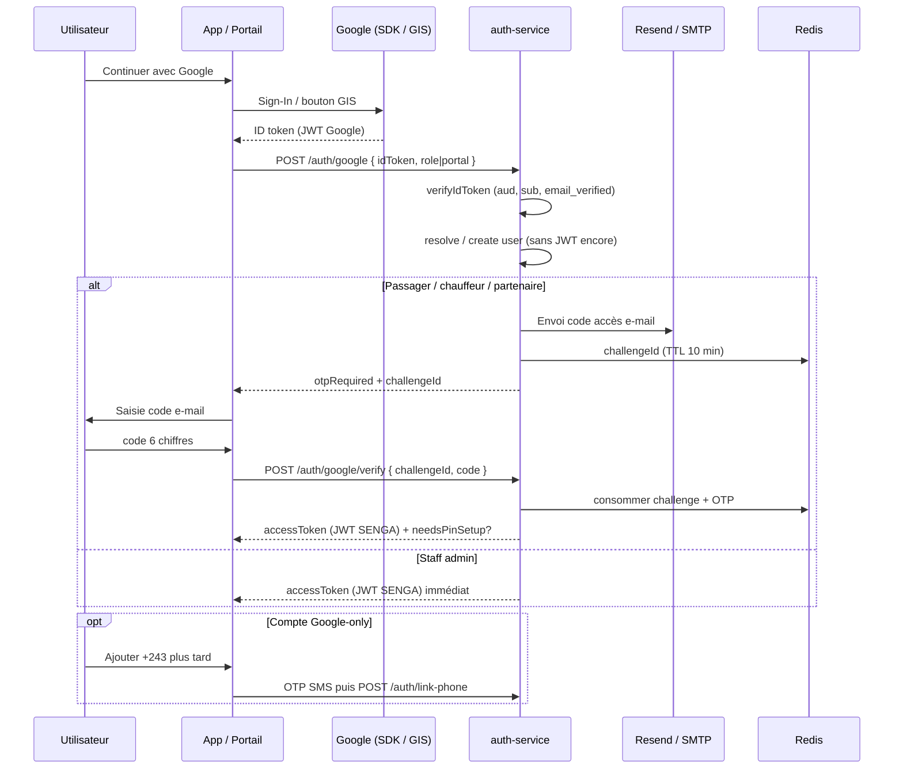

# Connexion compte Google — procédure réutilisable (SENGA / Mova)

**Public :** fondateur / équipe d’une **autre application** qui veut reproduire le même flux « Continuer avec Google ».  
**Langue :** français  
**Source de vérité code :** `services/auth-service` · `mobile/lib/core/auth/google_sign_in.dart` · portails Next.js (`web`, `admin`, `restaurant`, `rental-partner`)  
**Env (exemples, pas de secrets) :** [`config/external-apis.env.example`](../../config/external-apis.env.example)  
**Version :** septembre 2026

---

## 0. Ce que fait le flux SENGA (en une phrase)

Le client obtient un **ID token Google** (JWT Google), le backend le **vérifie** (signature + `aud` + e-mail vérifié), crée ou rattache un utilisateur, envoie éventuellement un **OTP e-mail**, puis délivre un **JWT de session SENGA** (+ invitation à configurer un PIN local).

Les **client IDs OAuth** (`….apps.googleusercontent.com`) sont **publics** (pas des secrets). Ne jamais committer de **client secret** OAuth, clés Resend/SMTP, ni fichiers `pay.json` / `sms.json`.

---

## 1. Cartographie SENGA

| Surface | Stack | Comment Google est obtenu | Intent envoyé à l’API |
|---------|--------|---------------------------|------------------------|
| App passager | Flutter + `google_sign_in` | SDK → `idToken` | `{ role: "PASSENGER" }` |
| App chauffeur | Flutter + `google_sign_in` | SDK → `idToken` | `{ role: "DRIVER" }` |
| Web PWA | Next.js + **Google Identity Services (GIS)** | `credential` (ID token) | `{ intendedRole: "PASSENGER" }` |
| Admin | Next.js + GIS | idem | `{ role: "ADMIN" }` |
| Restaurant | Next.js + GIS | idem | `{ role, intendedRole: "RESTAURANT", portal: "restaurant" }` |
| Location | Next.js + GIS | idem | `{ role, intendedRole: "RENTAL_PARTNER", portal: "rental" }` |

**Backend :** `mova-auth` (`services/auth-service`) via gateway — chemins clients :

| Étape | Méthode | Chemin gateway | Auth |
|-------|---------|----------------|------|
| 1. Vérifier ID token Google | `POST` | `/api/auth/google` | Non |
| 2. Vérifier OTP e-mail | `POST` | `/api/auth/google/verify` | Non |
| Lier Google (compte déjà JWT) | `POST` | `/api/auth/link-google` | Bearer JWT |
| Lier téléphone +243 | `POST` | `/api/auth/link-phone` | Bearer JWT |
| Délier Google / téléphone | `POST` | `/api/auth/unlink-google` · `/api/auth/unlink-phone` | Bearer JWT |

Côté Nest (sans préfixe gateway) : `/auth/google`, `/auth/google/verify`, etc.

**iOS :** le repo prévoit `GOOGLE_IOS_CLIENT_ID` côté auth, mais la production SENGA est centrée **Android + Web**. Adapter iOS = client OAuth iOS + URL schemes / `GoogleService-Info.plist` (hors scope Flutter actuel).

---

## 2. Prérequis Google Cloud Console

### 2.1 Projet et écran de consentement

1. Créer (ou réutiliser) un **projet Google Cloud**.
2. **APIs & Services → OAuth consent screen** :
   - Type : External (ou Internal si Workspace uniquement).
   - Nom d’app, e-mail support, domaines autorisés.
   - Scopes minimaux : `openid`, `email`, `profile` (GIS / Sign-In les demandent implicitement).
3. Publier l’app en **Testing** (testers listés) puis **Production** quand prêt.

### 2.2 Clients OAuth à créer

| Type de client | Rôle | Où il est utilisé |
|----------------|------|-------------------|
| **Web** | ID token vérifiable par le backend ; `serverClientId` Flutter ; `client_id` GIS | `GOOGLE_CLIENT_ID` / `NEXT_PUBLIC_GOOGLE_CLIENT_ID` / `GOOGLE_SERVER_CLIENT_ID` |
| **Android** (un par empreinte SHA-1) | Autorise Play Services sur le package | Console Google + audiences backend (`GOOGLE_ANDROID_CLIENT_ID`) |
| **iOS** (optionnel) | Sign-In iOS | `GOOGLE_IOS_CLIENT_ID` |

**Règle critique Android :** Google Cloud autorise **une seule empreinte SHA-1 par client OAuth Android**. Ne remplacez pas le SHA-1 « upload » par celui de Play App Signing — créez un **deuxième client Android** (même package).

### 2.3 Packages Android SENGA (référence)

| Flavor | `applicationId` |
|--------|-----------------|
| Passager | `cd.mova.mova.passenger` |
| Chauffeur | `cd.mova.mova.driver` |

Empreintes typiques à enregistrer (votre autre app : les vôtres) :

| Certificat | Usage |
|------------|--------|
| Debug (`keytool -list -v -keystore ~/.android/debug.keystore`) | `flutter run` / sideload |
| Upload keystore | AAB signé avant upload Play |
| **Play App Signing — SHA-1 classique** (pas SHA-256, pas PQC) | Builds installés depuis le Play Store |

Sans le SHA-1 Play App Signing → erreur Play Services **ApiException 10 / DEVELOPER_ERROR** sur les installs Play (ce n’est **pas** un bug API).

### 2.4 Origines Web (GIS)

Pour chaque portail Next.js, dans le client OAuth **Web** :

- **Authorized JavaScript origins** : `https://votre-domaine`, `http://localhost:3001`, etc.
- **Authorized redirect URIs** : souvent inutiles en mode bouton GIS (`ux_mode` popup implicite) ; garder cohérent si vous utilisez un redirect flow.

---

## 3. Configuration clients

### 3.1 Mobile Flutter (Android)

Fichiers SENGA :

- `mobile/lib/core/auth/google_sign_in.dart` — `GoogleSignIn(serverClientId: …)`
- `mobile/lib/core/config/market_config.dart` — `GOOGLE_SERVER_CLIENT_ID` via `--dart-define`
- Dépendance : `google_sign_in: ^6.2.2` (`mobile/pubspec.yaml`)

**Obligatoire :** `serverClientId` = client OAuth **Web** (jamais un client Android). Sinon `idToken` est `null` → erreur `id_token_missing`.

```dart
GoogleSignIn(
  serverClientId: 'VOTRE_CLIENT_WEB.apps.googleusercontent.com',
);
```

Build release (CI SENGA) :

```bash
flutter build appbundle --release \
  --flavor passenger \
  -t lib/main_passenger.dart \
  --dart-define=GOOGLE_SERVER_CLIENT_ID=VOTRE_CLIENT_WEB.apps.googleusercontent.com
```

Flux UI typique (`phone_login_panel.dart`) :

1. `signInWithGoogleIdToken()` → ID token  
2. `POST /auth/google` avec `{ idToken, role }`  
3. Si `otpRequired` → saisir code e-mail → `POST /auth/google/verify`  
4. Stocker `accessToken` ; si `needsPinSetup` → écran PIN local  

Liaison ultérieure téléphone / Google : `AccountLinkCard` → `/auth/link-phone` · `/auth/link-google`.

### 3.2 Web / portails (GIS)

Fichier type : `web/src/components/GoogleContinueButton.tsx` (mêmes motifs dans `admin`, `restaurant`, `rental-partner`).

1. Charger `https://accounts.google.com/gsi/client`
2. `google.accounts.id.initialize({ client_id, callback })`
3. Le callback reçoit `response.credential` = **ID token** (même objet que Flutter)
4. Envoyer à `POST /api/auth/google`

Variable build Next.js :

```bash
NEXT_PUBLIC_GOOGLE_CLIENT_ID=VOTRE_CLIENT_WEB.apps.googleusercontent.com
```

Doit être **identique** au `GOOGLE_CLIENT_ID` du backend (même client Web).

### 3.3 iOS (si vous l’ajoutez)

1. Client OAuth iOS dans Google Cloud (bundle ID).  
2. Configurer URL scheme / `GIDClientID` selon la doc `google_sign_in`.  
3. Ajouter l’ID client à `GOOGLE_IOS_CLIENT_ID` (audiences backend).  
4. Utiliser le **même** `serverClientId` Web pour obtenir un ID token vérifiable.

---

## 4. Backend — vérification et session

### 4.1 Bibliothèque

- Package : `google-auth-library` (`OAuth2Client.verifyIdToken`)
- Module : `services/auth-service/src/auth/google-id-token.ts`
- Service métier : `AuthService.loginWithGoogle` / `verifyGoogleOtp` / `linkGoogle`

### 4.2 Audiences acceptées (`aud`)

Le backend fusionne :

1. Liste en dur `PRODUCTION_GOOGLE_CLIENT_IDS` (IDs publics SENGA déjà déployés)
2. Variables d’env (séparateur `,` ou espace) :
   - `GOOGLE_CLIENT_ID` / alias `GOOGLE_OAUTH_CLIENT_ID`
   - `GOOGLE_ANDROID_CLIENT_ID`
   - `GOOGLE_ANDROID_CLIENT_ID_PASSENGER` / `_DRIVER` (optionnel)
   - `GOOGLE_IOS_CLIENT_ID`

Avec Flutter + `serverClientId` Web, le claim `aud` de l’ID token est en pratique le **client Web**. Les clients Android servent à Play Services ; les lister côté backend reste une bonne pratique de défense en profondeur.

### 4.3 Claims utilisés après vérification

| Claim / champ | Usage SENGA |
|---------------|-------------|
| `sub` | `googleId` unique (clé de rattachement) |
| `aud` | Doit matcher une audience autorisée |
| `email` | Identité / OTP / matching compte existant (normalisé lower-case) |
| `email_verified` | Doit être `true` si e-mail présent |
| `given_name` / `family_name` / `name` | Prénom / nom (fallback split sur `name`) |
| `picture` | `avatarUrl` si vide |

Erreurs typiques mappées en `MOVA_AUTH_009` (`AUTH_INVALID_GOOGLE`) : jeton manquant, invalide, mauvaise audience, Google non configuré (503).

### 4.4 Corps des requêtes

**`POST /api/auth/google`**

```json
{
  "idToken": "<JWT Google>",
  "role": "PASSENGER"
}
```

Variantes : `role` + `portal` + `intendedRole` (portails partenaires), ou `role: "ADMIN"` (console).

**Réponse A — OTP e-mail requis** (passager, chauffeur, resto, location) :

```json
{
  "success": true,
  "otpRequired": true,
  "challengeId": "<uuid>",
  "otpChannel": "email",
  "destinationMasked": "j***@exemple.com",
  "message": "Code envoyé par e-mail. Vérifiez votre boîte de réception."
}
```

Challenge Redis : préfixe `auth:google:ch:` · TTL **10 minutes**.

**Réponse B — session directe** (staff / SUPER_ADMIN allowlist) :

```json
{
  "accessToken": "<JWT SENGA>",
  "user": { "id": "…", "role": "ADMIN", "…" },
  "isNew": false,
  "needsPinSetup": false
}
```

**`POST /api/auth/google/verify`**

```json
{
  "challengeId": "<uuid>",
  "code": "847291",
  "role": "PASSENGER"
}
```

→ JWT session + éventuellement `needsPinSetup: true`.

### 4.5 Création / rattachement utilisateur

Ordre de résolution (`resolveGoogleLoginUser`) :

1. Chercher `User.googleId == sub`
2. Sinon chercher `User.email` (insensible à la casse)
3. Staff : **pas** d’auto-inscription — le compte doit déjà exister (sauf allowlist propriétaire)
4. Nouveau compte autorisé selon le rôle :
   - **PASSENGER** → `ACTIVE`
   - **DRIVER** → `PENDING_KYC`
   - **RESTAURANT** / **RENTAL_PARTNER** → auto-register partenaire si politique le permet
5. `attachGoogleIdentity` remplit `googleId`, e-mail, nom, avatar sans écraser des valeurs déjà présentes
6. `provisionUser` (wallet, etc.) + event Redis `USER_CREATED` si nouveau

**Règles de rôle :** pas de promotion silencieuse. Un passager ne peut pas se connecter sur l’app chauffeur (et inversement) avec le même Google.

### 4.6 Lier le téléphone plus tard

Compte Google-only (pas de +243) :

1. JWT obtenu via Google + OTP e-mail  
2. `POST /api/auth/otp/request` avec le numéro  
3. `POST /api/auth/link-phone` `{ phone, otpCode }` (Bearer)

Inversement : compte téléphone → `POST /api/auth/link-google` `{ idToken }` (parfois OTP SMS si déjà un numéro).

**Déliaison :** impossible de rester sans identité — on ne délies Google que si un téléphone reste, et inversement.

### 4.7 E-mail OTP (dépendance critique)

Sans Resend/SMTP configuré en production, le login Google des rôles non-staff **échoue** (l’API n’autorise pas de contourner l’OTP). Variables : `RESEND_API_KEY`, `RESEND_FROM`, ou `SMTP_*` — voir `config/external-apis.env.example`.

---

## 5. Diagramme de séquence



---

## 6. Checklist variables d’environnement

Placeholders uniquement — **ne pas** coller de secrets réels dans le repo.

### Backend (`mova-auth` / Render)

| Variable | Exemple | Notes |
|----------|---------|--------|
| `GOOGLE_CLIENT_ID` | `123456789-xxxx.apps.googleusercontent.com` | Client **Web** |
| `GOOGLE_OAUTH_CLIENT_ID` | *(vide ou même valeur)* | Alias accepté |
| `GOOGLE_ANDROID_CLIENT_ID` | `…android1…, …android2…` | Liste CSV des clients Android |
| `GOOGLE_ANDROID_CLIENT_ID_PASSENGER` | *(optionnel)* | Extra passager |
| `GOOGLE_ANDROID_CLIENT_ID_DRIVER` | *(optionnel)* | Extra chauffeur |
| `GOOGLE_IOS_CLIENT_ID` | `….apps.googleusercontent.com` | Si iOS |
| `RESEND_API_KEY` / `RESEND_FROM` | `re_…` / `noreply@votre-domaine.com` | OTP e-mail Google-only |
| `SMTP_*` | host / user / pass | Alternative à Resend |

### Next.js (bake au build)

| Variable | Exemple |
|----------|---------|
| `NEXT_PUBLIC_GOOGLE_CLIENT_ID` | Même ID que `GOOGLE_CLIENT_ID` (Web) |

### Flutter

| Define | Exemple |
|--------|---------|
| `--dart-define=GOOGLE_SERVER_CLIENT_ID=…` | Même ID Web |

Référence commentaires : `config/external-apis.env.example` (section « Auth sociale ») · `admin/.env.example` · `web/.env.example` · `restaurant/.env.example` · `rental-partner/.env.example` · `render.yaml` (`sync: false` pour les clés Google).

---

## 7. Pièges fréquents (tirés de ce codebase)

1. **`serverClientId` = client Android** → pas d’`idToken`. Toujours le client **Web**.  
2. **Un seul client Android, SHA-1 remplacé** → casse debug **ou** Play. Un client **par** SHA-1, même package.  
3. **SHA-1 Play App Signing oublié** → ApiException **10** uniquement sur installs Play.  
4. **Mauvaise audience backend** → `GOOGLE_AUDIENCE_MISMATCH` / « jeton destiné à une autre application ». Ajouter le nouvel ID client aux env (ou rebuild avec le bon Web ID).  
5. **E-mail Google non vérifié** → refus API.  
6. **Pas d’e-mail sur le compte Google** → refus ; proposer SMS / autre compte.  
7. **Resend/SMTP absent** → OTP e-mail impossible → login Google passager/chauffeur/portail en 503/échec.  
8. **Staff inexistant** → Google admin refuse l’auto-création.  
9. **Mauvais rôle / mauvais portail** → messages du type « utilisez l’app chauffeur » / compte partenaire manquant.  
10. **Session Google stale** → SENGA force `signOut()` avant `signIn()` pour éviter un `idToken` null.  
11. **Confondre ID token et access token Google** — seul l’**ID token** (`credential` GIS / `authentication.idToken`) est envoyé à `/auth/google`.  
12. **Comptes test Play / Test Lab** — certains e-mails sont refusés (`play-prelaunch`) pour éviter le bruit Store.

---

## 8. Checklist d’adaptation — « une autre app »

Copiez et cochez :

### Google Cloud

- [ ] Projet Cloud + écran de consentement OAuth  
- [ ] Client OAuth **Web** créé ; origines JS pour chaque domaine  
- [ ] Clients OAuth **Android** : un par SHA-1 (debug, upload, Play App Signing) · package exact  
- [ ] Client **iOS** si besoin  

### Backend

- [ ] Endpoint `POST /auth/google` : vérifie ID token avec `google-auth-library`  
- [ ] Audiences = tous vos client IDs (Web + Android + iOS)  
- [ ] Politique claire : auto-register vs invite-only vs staff pré-provisionné  
- [ ] 2e facteur : OTP e-mail (comme SENGA) **ou** JWT immédiat si vous acceptez le risque  
- [ ] Envoi e-mail opérationnel (Resend/SMTP) avant prod Google-only  
- [ ] Modèle User : champs `googleId` (unique), `email`, liaison téléphone optionnelle  
- [ ] JWT / session de **votre** app après succès (ne réutilisez pas le JWT SENGA)  

### Clients

- [ ] Mobile : `serverClientId` = Web ID ; flavors / packages alignés Console  
- [ ] Web : GIS + `NEXT_PUBLIC_GOOGLE_CLIENT_ID` (ou équivalent)  
- [ ] UI : gérer `otpRequired` + `challengeId` si vous reprenez le 2FA e-mail  
- [ ] Profil : lier / délier Google ↔ téléphone sans laisser le compte orphelin  

### Sécurité / ops

- [ ] Aucun **client secret** Google dans le repo mobile (ID token flow n’en a pas besoin côté app)  
- [ ] Secrets e-mail / DB uniquement en vault / Render `sync: false`  
- [ ] Tests : debug install, sideload release, install Play Store (trois SHA-1)  
- [ ] Messages d’erreur utilisateur distincts Google vs SMS (ne pas polluer le chemin OTP téléphone)  

### Ce que vous ne réutilisez **pas** de SENGA

- Les JWT / cookies de session SENGA  
- Les wallets / rôles métier SENGA (`PASSENGER`, `DRIVER`, …) sauf si vous branchez volontairement la même API  
- Les client IDs SENGA en dur (`PRODUCTION_GOOGLE_CLIENT_IDS`) — créez **vos** clients dans **votre** projet Cloud  

---

## 9. Fichiers de référence dans ce dépôt

| Fichier | Rôle |
|---------|------|
| `services/auth-service/src/auth/google-id-token.ts` | Vérification ID token + audiences |
| `services/auth-service/src/auth/auth.service.ts` | Login, OTP, link/unlink, auto-register |
| `services/auth-service/src/auth/auth.controller.ts` | Routes HTTP |
| `services/auth-service/src/auth/auth.dto.ts` | DTOs `idToken`, `challengeId`, intents |
| `mobile/lib/core/auth/google_sign_in.dart` | SDK Flutter + messages d’erreur SHA-1 |
| `mobile/lib/features/auth/phone_login_panel.dart` | UI login Google + OTP |
| `mobile/lib/features/profile/account_link_card.dart` | Liaison Google / téléphone |
| `web|admin|restaurant|rental-partner/.../GoogleContinueButton.tsx` | Bouton GIS |
| `config/external-apis.env.example` | Checklist env (placeholders / IDs publics) |
| `.github/workflows/mobile-release.yml` | `--dart-define=GOOGLE_SERVER_CLIENT_ID` |

---

## 10. Résumé fondateur

Pour une autre application : créez un client OAuth **Web** + des clients **Android** (un SHA-1 chacun), faites signer un ID token côté app, vérifiez-le côté API, puis émettez **votre** session. SENGA ajoute un OTP e-mail avant le JWT pour les utilisateurs non-staff, et permet de lier un numéro +243 ensuite — à reproduire ou simplifier selon votre risque.
